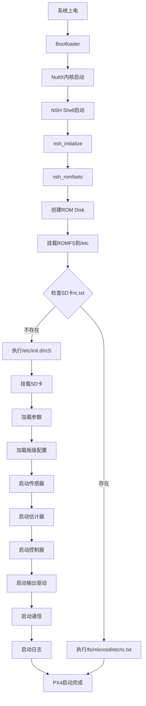

# 21-PX4 rcS启动脚本机制详解
## 从系统启动到模块加载的完整分析

---

## 1. 概述

本文档详细解析PX4系统中的`rcS`启动脚本机制，包括其命名来源、作用、加载方式、文件系统存储位置，以及与RT-Thread等RTOS自动化初始化机制的对比。

### 核心问题
1. rcS是什么？为什么叫这个名字？
2. rcS的作用和核心功能
3. rcS在源码中的位置及编译到固件的方式
4. 系统如何找到并加载rcS
5. 有SD卡和无SD卡时rcS的存储位置
6. 修改源码rcS vs 修改文件系统rcS的区别
7. rcS与Linux init.d和RT-Thread自动初始化的对比

---

## 2. rcS命名来源与历史背景

### 2.1 rcS的含义

**rcS** = **Run Commands Startup**

- **rc**: Run Commands（运行命令）的缩写
- **S**: Startup（启动）的缩写

### 2.2 历史渊源

rcS这个命名来源于**Unix/Linux系统**的启动机制：

#### Linux init系统中的rc脚本
```
/etc/init.d/
├── rcS         # System initialization script（系统初始化脚本）
├── rc0.d/      # Runlevel 0 scripts
├── rc1.d/      # Runlevel 1 scripts
├── rc2.d/      # Runlevel 2 scripts
└── ...
```

**是的，可以类比Linux的init.d启动机制！**

| 特性 | Linux rcS | PX4 rcS | 说明 |
|------|-----------|---------|------|
| **作用** | 系统启动初始化 | 飞控系统启动初始化 | ✅ 相同 |
| **执行时机** | 内核启动后 | NuttX启动后 | ✅ 相同 |
| **脚本语言** | Shell (bash/sh) | Shell (NSH) | ✅ 相同 |
| **加载方式** | init进程 | NSH shell | 🔄 类似 |
| **文件位置** | `/etc/init.d/rcS` | `/etc/init.d/rcS` | ✅ 完全相同 |

### 2.3 NuttX中的实现

PX4基于**NuttX RTOS**，而NuttX借鉴了Unix的启动机制：

**文件**: `platforms/nuttx/NuttX/apps/nshlib/README.md`
```markdown
System-init script is executed before Start-up script.
- System-init script: /etc/init.d/rc.sysinit (系统初始化)
- Start-up script: /etc/init.d/rcS (应用启动)
```

**配置**: `platforms/nuttx/NuttX/apps/nshlib/Kconfig`
```kconfig
config NSH_INITSCRIPT
	string "Relative path to startup script"
	default "init.d/rcS"
	---help---
		This is the relative path to the startup script within the mountpoint.
		The default is init.d/rcS.
```

---

## 3. rcS的作用与核心功能

### 3.1 总体作用

rcS是PX4系统的**主启动脚本**，负责：
1. ✅ 初始化文件系统（挂载SD卡）
2. ✅ 加载和初始化参数系统
3. ✅ 加载板级配置（rc.board_defaults等）
4. ✅ 启动传感器驱动
5. ✅ 启动状态估计器（EKF2）
6. ✅ 启动控制模块（Commander、Navigator等）
7. ✅ 启动输出驱动（PWM、DShot）
8. ✅ 启动MAVLink通信
9. ✅ 启动日志记录器

### 3.2 rcS启动流程图

```
┌──────────────────────────────────────────────────────────────┐
│  系统上电                                                      │
└──────────────────────────────────────────────────────────────┘
                          ↓
┌──────────────────────────────────────────────────────────────┐
│  Bootloader → NuttX内核启动                                   │
└──────────────────────────────────────────────────────────────┘
                          ↓
┌──────────────────────────────────────────────────────────────┐
│  NSH (NuttX Shell) 启动                                       │
│  nsh_initialize() → nsh_romfsetc()                           │
└──────────────────────────────────────────────────────────────┘
                          ↓
┌──────────────────────────────────────────────────────────────┐
│  1. 创建ROM Disk (ROMFS镜像内嵌在固件中)                     │
│  2. 挂载ROMFS到 /etc 目录                                     │
│     /etc/init.d/rcS                                          │
│     /etc/init.d/rc.sysinit                                   │
└──────────────────────────────────────────────────────────────┘
                          ↓
┌──────────────────────────────────────────────────────────────┐
│  执行 /etc/init.d/rc.sysinit (系统初始化脚本)                │
│  - 创建RAMDISK                                                │
│  - 挂载/tmp目录                                               │
└──────────────────────────────────────────────────────────────┘
                          ↓
┌──────────────────────────────────────────────────────────────┐
│  执行 /etc/init.d/rcS (PX4主启动脚本) ← 本文重点！            │
└──────────────────────────────────────────────────────────────┘
                          ↓
┌──────────────────────────────────────────────────────────────┐
│  PX4系统完全启动，mavlink boot_complete                      │
└──────────────────────────────────────────────────────────────┘
```

### 3.3 rcS核心部分解析

#### 阶段1: 文件系统挂载 (行 50-95)

```bash
# 尝试挂载microSD卡
if [ -b "/dev/mmcsd0" ]
then
	if mount -t vfat /dev/mmcsd0 /fs/microsd
	then
		set STORAGE_AVAILABLE yes
	fi
fi
```

**作用**：
- 检测SD卡设备（`/dev/mmcsd0`）
- 挂载FAT32文件系统到`/fs/microsd`
- 设置存储可用标志

#### 阶段2: 参数系统初始化 (行 116-184)

```bash
if [ $STORAGE_AVAILABLE = yes ]
then
	set PARAM_FILE /fs/microsd/params
	set PARAM_BACKUP_FILE "/fs/microsd/parameters_backup.bson"
fi

# 加载参数文件路径配置
. ${R}etc/init.d/rc.filepaths

# 加载工厂校准数据（如果存在）
if mft query -q -k MTD -s MTD_CALDATA -v /fs/mtd_caldata
then
	param load /fs/mtd_caldata
fi

# 选择并导入参数文件
param select $PARAM_FILE
if ! param import
then
	echo "ERROR [init] param import failed"
	# 尝试从备份恢复
	if [ -f $PARAM_BACKUP_FILE ]
	then
		param import $PARAM_BACKUP_FILE
		cp $PARAM_BACKUP_FILE $PARAM_FILE
	fi
fi
```

**作用**：
1. 设置参数文件路径（SD卡或Flash）
2. 加载工厂校准数据（存储在MTD Flash中）
3. 导入用户参数（从SD卡或Flash）
4. 失败时尝试从备份恢复

#### 阶段3: 加载板级配置 (行 199-229)

```bash
# 板级架构默认配置
set BOARD_ARCH_RC_DEFAULTS ${R}etc/init.d/rc.board_arch_defaults
if [ -f $BOARD_ARCH_RC_DEFAULTS ]
then
	echo "Board architecture defaults: ${BOARD_ARCH_RC_DEFAULTS}"
	. $BOARD_ARCH_RC_DEFAULTS
fi

# 板级默认配置
set BOARD_RC_DEFAULTS ${R}etc/init.d/rc.board_defaults
if [ -f $BOARD_RC_DEFAULTS ]
then
	echo "Board defaults: ${BOARD_RC_DEFAULTS}"
	. $BOARD_RC_DEFAULTS  # ← 这里执行板级默认参数设置
fi

# 板级额外初始化
set BOARD_RC_ADDITIONAL_INIT ${R}etc/init.d/rc.additional_init
if [ -f $BOARD_RC_ADDITIONAL_INIT ]
then
	echo "Board additional init: ${BOARD_RC_ADDITIONAL_INIT}"
	. $BOARD_RC_ADDITIONAL_INIT
fi
```

**作用**：
- 加载板级特定的默认参数
- 执行板级特定的初始化代码
- 例如：MicoAir H743的`rc.board_defaults`设置电池参数、IMU配置等

#### 阶段4: 机架配置加载 (行 231-262)

```bash
# 加载机架配置
. ${R}etc/init.d/rc.autostart

if [ ${VEHICLE_TYPE} = none ]
then
	# 如果ROMFS中没有找到，尝试SD卡上的外部机架配置
	if [ $STORAGE_AVAILABLE = yes ]
	then
		. ${R}etc/init.d/rc.autostart_ext
	fi
fi

# 检查参数版本，版本不匹配时重置
if ! param compare SYS_PARAM_VER ${PARAM_DEFAULTS_VER}
then
	echo "Switched to different parameter version. Resetting parameters."
	param set SYS_PARAM_VER ${PARAM_DEFAULTS_VER}
	param set SYS_AUTOCONFIG 1
	param save
	reboot
fi
```

**作用**：
- 根据`SYS_AUTOSTART`参数加载机架配置（如四旋翼、固定翼等）
- 支持SD卡外部机架配置
- 版本管理，确保参数版本一致

#### 阶段5: 启动核心模块 (行 268-480)

```bash
# 启动音调报警
tone_alarm start

# 启动数据管理器（航点存储）
dataman start

# 启动负载监控
load_mon start

# 启动RGB LED指示灯
rgbled start -X -q

# 启动传感器系统
if param greater SYS_HITL 0
then
	sensors start -h  # HITL模式
else
	. ${R}etc/init.d/rc.board_sensors  # 板级传感器配置
	. ${R}etc/init.d/rc.sensors        # 通用传感器启动
	sensors start
fi

# 启动状态估计器
if param compare -s EKF2_EN 1
then
	ekf2 start &
fi

# 启动RC遥控和手动控制
rc_update start
manual_control start

# 启动Commander（系统状态管理）
commander start

# 启动电机输出
dshot start
pwm_out start
```

**作用**：
- 按依赖顺序启动各个模块
- 传感器 → 状态估计器 → 控制器 → 执行器

#### 阶段6: 启动通信和日志 (行 505-613)

```bash
# 启动串口设备驱动（自动生成）
. ${R}etc/init.d/rc.serial

# 启动RC输入
rc_input start $RC_INPUT_ARGS

# 启动USB MAVLink
if param greater -s SYS_USB_AUTO -1
then
	if ! cdcacm_autostart start
	then
		sercon
		mavlink start -d /dev/ttyACM0
	fi
fi

# 启动导航器
navigator start

# 启动日志记录器
. ${R}etc/init.d/rc.logging
```

---

## 4. rcS在源码中的位置与编译过程

### 4.1 源码位置

PX4有多个版本的rcS，针对不同平台：

| 平台 | rcS路径 | 说明 |
|------|---------|------|
| **NuttX (硬件飞控)** | `ROMFS/px4fmu_common/init.d/rcS` | ✅ 主要使用 |
| **POSIX (SITL仿真)** | `ROMFS/px4fmu_common/init.d-posix/rcS` | 仿真专用 |
| **CAN节点** | `ROMFS/cannode/init.d/rcS` | UAVCAN节点 |
| **性能测试** | `ROMFS/performance-test/init.d/rcS` | 测试专用 |

**以MicoAir H743为例**：
```
源码位置: ROMFS/px4fmu_common/init.d/rcS
板级配置: boards/micoair/h743/init/rc.board_defaults
          boards/micoair/h743/init/rc.board_sensors
```

### 4.2 rcS的编译过程

#### 步骤1: CMake配置ROMFS

**文件**: `ROMFS/px4fmu_common/init.d/CMakeLists.txt`

```cmake
px4_add_romfs_files(
	rcS                    # ← rcS被添加到ROMFS
	rc.sensors
	rc.vehicle_setup
	# ... 其他脚本
)
```

**文件**: `cmake/kconfig.cmake`

```cmake
if(ROMFSROOT)
	set(config_romfs_root ${ROMFSROOT} CACHE INTERNAL "ROMFS root" FORCE)
endif()
```

**文件**: `boards/micoair/h743/default.px4board` (Kconfig配置)

```kconfig
CONFIG_BOARD_ROMFSROOT="px4fmu_common"  # ← 使用px4fmu_common作为ROMFS根
```

#### 步骤2: 生成ROMFS镜像

**过程**：
```
1. CMake收集所有ROMFS文件
   ├── ROMFS/px4fmu_common/init.d/rcS
   ├── ROMFS/px4fmu_common/init.d/rc.sensors
   ├── boards/micoair/h743/init/rc.board_defaults  ← 复制到ROMFS
   └── ... (其他配置文件)

2. 生成临时ROMFS目录结构
   build/px4_fmu-v6x_default/etc/
   ├── init.d/
   │   ├── rcS
   │   ├── rc.board_defaults
   │   ├── rc.sensors
   │   └── ...
   └── extras/

3. 使用genromfs工具创建ROMFS镜像
   genromfs -f romfs.img -d build/px4_fmu-v6x_default/etc/ -V "NSHInitVol"

4. 转换为C数组（nsh_romfsimg.h）
   xxd -i romfs.img > nsh_romfsimg.h
```

**生成的C代码示例**：
```c
// platforms/nuttx/NuttX/include/nsh_romfsimg.h (构建时生成)
const unsigned char romfs_img[] = {
    0x2d, 0x72, 0x6f, 0x6d, 0x31, 0x66, 0x73, 0x2d,
    0x00, 0x00, 0x01, 0x48, 0x9e, 0xb5, 0xf7, 0x20,
    // ... rcS脚本的二进制数据
};
const unsigned int romfs_img_len = 65536;
```

#### 步骤3: 嵌入固件

**文件**: `platforms/nuttx/NuttX/apps/nshlib/nsh_romfsetc.c`

```c
#ifdef CONFIG_NSH_ARCHROMFS
#  include <arch/board/nsh_romfsimg.h>  // ← 包含ROMFS镜像数据
#endif

int nsh_romfsetc(void)
{
	struct boardioc_romdisk_s desc;

	// 使用ROMFS镜像创建ROM Disk
	desc.minor    = CONFIG_NSH_ROMFSDEVNO;
	desc.nsectors = NSECTORS(romfs_img_len);
	desc.sectsize = CONFIG_NSH_ROMFSSECTSIZE;
	desc.image    = romfs_img;  // ← 指向嵌入的ROMFS数据

	// 注册ROM Disk设备
	ret = boardctl(BOARDIOC_ROMDISK, (uintptr_t)&desc);

	// 挂载ROMFS到/etc
	ret = mount(MOUNT_DEVNAME, "/etc", "romfs", MS_RDONLY, NULL);

	return OK;
}
```

**最终效果**：
- ROMFS镜像以**C数组**形式嵌入到固件二进制文件中
- 大小约64KB-256KB（取决于包含的脚本数量）
- 固件烧录后，ROMFS数据存储在Flash中

---

## 5. rcS的加载与执行时机

### 5.1 NuttX启动流程

```
┌────────────────────────────────────────────────────────────┐
│ 1. 上电 → Bootloader → NuttX内核启动                        │
└────────────────────────────────────────────────────────────┘
                         ↓
┌────────────────────────────────────────────────────────────┐
│ 2. NuttX内核初始化                                          │
│    - 初始化内存                                             │
│    - 初始化设备驱动                                         │
│    - 创建init任务                                           │
└────────────────────────────────────────────────────────────┘
                         ↓
┌────────────────────────────────────────────────────────────┐
│ 3. NSH Shell启动                                            │
│    nsh_main() → nsh_initialize()                           │
└────────────────────────────────────────────────────────────┘
                         ↓
┌────────────────────────────────────────────────────────────┐
│ 4. ROMFS挂载                                                │
│    nsh_romfsetc()                                          │
│    - 创建ROM Disk (/dev/ram0)                              │
│    - 挂载ROMFS到 /etc                                       │
└────────────────────────────────────────────────────────────┘
                         ↓
┌────────────────────────────────────────────────────────────┐
│ 5. 执行系统初始化脚本                                       │
│    nsh_script("/etc/init.d/rc.sysinit")                   │
└────────────────────────────────────────────────────────────┘
                         ↓
┌────────────────────────────────────────────────────────────┐
│ 6. 执行启动脚本 ← rcS在这里执行！                          │
│    nsh_script("/etc/init.d/rcS")                           │
└────────────────────────────────────────────────────────────┘
                         ↓
┌────────────────────────────────────────────────────────────┐
│ 7. PX4系统启动完成                                          │
│    NSH命令行可用 (nsh>)                                     │
└────────────────────────────────────────────────────────────┘
```

### 5.2 关键源码分析

#### nsh_initialize() 函数

**文件**: `platforms/nuttx/NuttX/apps/nshlib/nsh_init.c`

```c
int nsh_initialize(void)
{
#ifdef CONFIG_NSH_ROMFSETC
  /* 1. 挂载ROMFS文件系统到/etc */
  ret = nsh_romfsetc();
  if (ret < 0)
    {
      return ERROR;
    }

  /* 2. 执行系统初始化脚本 /etc/init.d/rc.sysinit */
  ret = nsh_script(vtbl, "sysinit", CONFIG_NSH_SYSINITSCRIPT);
  if (ret < 0)
    {
      // 继续执行，不是致命错误
    }

  /* 3. 执行启动脚本 /etc/init.d/rcS */
  ret = nsh_script(vtbl, "startup", CONFIG_NSH_INITSCRIPT);  // ← rcS在这里执行
  if (ret < 0)
    {
      return ERROR;
    }
#endif

  return OK;
}
```

**配置值**：
```kconfig
CONFIG_NSH_SYSINITSCRIPT = "init.d/rc.sysinit"
CONFIG_NSH_INITSCRIPT = "init.d/rcS"
CONFIG_NSH_ROMFSMOUNTPT = "/etc"
```

#### nsh_script() 函数

**文件**: `platforms/nuttx/NuttX/apps/nshlib/nsh_script.c`

```c
int nsh_script(FAR struct nsh_vtbl_s *vtbl, FAR const char *cmd,
               FAR const char *path)
{
  FAR char *fullpath;
  FAR FILE *stream;
  FAR char *buffer;

  /* 1. 获取完整路径 /etc/init.d/rcS */
  fullpath = nsh_getfullpath(vtbl, path);

  /* 2. 打开脚本文件 */
  stream = fopen(fullpath, "r");
  if (!stream)
    {
      return ERROR;
    }

  /* 3. 逐行读取并执行 */
  while (fgets(buffer, CONFIG_NSH_LINELEN, stream) != NULL)
    {
      /* 解析并执行命令 */
      ret = nsh_parse(vtbl, buffer);
    }

  fclose(stream);
  return ret;
}
```

**执行方式**：
- rcS是Shell脚本，由NSH逐行解析执行
- 每个命令都是PX4的内置命令或模块名
- 例如：`ekf2 start` → 调用`ekf2_main()`函数

---

## 6. rcS的存储位置详解

### 6.1 有SD卡的情况

```
文件系统结构:
/
├── dev/
│   ├── ram0          # ROM Disk (ROMFS镜像)
│   └── mmcsd0        # SD卡设备
├── etc/              # ROMFS挂载点（只读）
│   └── init.d/
│       ├── rcS       # ← 从固件Flash的ROMFS加载
│       ├── rc.board_defaults
│       ├── rc.sensors
│       └── ...
└── fs/
    └── microsd/      # SD卡挂载点（读写）
        ├── params    # 参数文件
        ├── log/      # 日志目录
        └── etc/      # 用户自定义脚本（可选）
            ├── rc.txt        # 自定义启动脚本（优先级最高）
            ├── config.txt    # 参数覆盖
            └── extras.txt    # 额外启动命令
```

**加载顺序**：
```bash
# rcS中的逻辑 (行124-127)
if [ -f /fs/microsd/etc/rc.txt ]
then
	. /fs/microsd/etc/rc.txt  # ← SD卡上的rc.txt优先级最高！
else
	# 执行ROMFS中的rcS
	. /etc/init.d/rcS
fi
```

**重要**：
- `/etc/init.d/rcS`：来自固件Flash（ROMFS），**只读**
- `/fs/microsd/etc/rc.txt`：SD卡上的自定义脚本，**可修改**
- 如果SD卡上存在`rc.txt`，将**完全替代**ROMFS中的rcS

### 6.2 无SD卡的情况

```
文件系统结构:
/
├── dev/
│   └── ram0          # ROM Disk (ROMFS镜像)
├── etc/              # ROMFS挂载点（只读）
│   └── init.d/
│       ├── rcS       # ← 从固件Flash的ROMFS加载
│       └── ...
└── mnt/
    └── microsd/      # MTD Flash挂载点（LittleFS/FlashFS）
        └── params    # 参数存储在内部Flash
```

**特点**：
- 没有SD卡，所有数据存储在内部Flash
- 使用FlashFS或LittleFS文件系统
- rcS仍然从ROMFS加载，存储在固件Flash中
- 参数文件存储在单独的Flash分区（`/mnt/microsd/params`）

### 6.3 rcS在Flash中的实际位置

以STM32H743为例：

```
Flash布局:
0x08000000  ┌─────────────────────────────────────┐
            │  Bootloader (32KB)                  │
0x08008000  ├─────────────────────────────────────┤
            │  PX4固件 (2MB)                       │
            │  ├── 代码段 (.text)                  │
            │  ├── 常量数据 (.rodata)              │
            │  │   └── romfs_img[]  ← ROMFS镜像在这里！
            │  │       ├── init.d/rcS              │
            │  │       ├── init.d/rc.sensors       │
            │  │       └── ...                    │
            │  └── 数据段 (.data)                  │
0x081E0000  ├─────────────────────────────────────┤
            │  参数存储区 (128KB, 可选)            │
0x08200000  └─────────────────────────────────────┘
```

**查看方法**：
```bash
# 查看固件中的符号
arm-none-eabi-nm build/micoair_h743_default/micoair_h743_default.elf | grep romfs
  0810a2c0 R romfs_img        # ← ROMFS数据起始地址
  0810a2c4 R romfs_img_len    # ← ROMFS大小

# 查看ROMFS内容
genromfs -d /etc  # 在飞控上执行
```

---

## 7. 修改rcS的两种方式及效果对比

### 7.1 方式1: 修改源码中的rcS

**步骤**：
```bash
# 1. 修改源码
vim ROMFS/px4fmu_common/init.d/rcS

# 例如：添加自定义模块启动
echo "my_module start" >> ROMFS/px4fmu_common/init.d/rcS

# 2. 重新编译固件
make micoair_h743_default

# 3. 烧录固件
make micoair_h743_default upload

# 4. 重启飞控
# 修改生效！
```

**效果**：
- ✅ 修改**永久生效**，嵌入固件
- ✅ 适用于**所有使用该固件的飞控**
- ✅ 修改被版本控制（Git）
- ❌ 需要重新编译和烧录固件
- ❌ 开发周期较长

**适用场景**：
- 正式产品发布
- 需要批量更新飞控
- 需要版本管理的修改

### 7.2 方式2: 修改SD卡上的rc.txt

**步骤**：
```bash
# 1. 在SD卡上创建自定义启动脚本
# SD卡路径: /fs/microsd/etc/rc.txt
# Windows路径: E:\etc\rc.txt

# 2. 编辑rc.txt（可以复制rcS内容后修改）
#!/bin/sh
# 自定义启动脚本

# 先执行原始rcS的部分功能
set R /
ver all

# 挂载SD卡
mount -t vfat /dev/mmcsd0 /fs/microsd
param select /fs/microsd/params
param import

# 加载板级配置
. ${R}etc/init.d/rc.board_defaults

# 启动传感器
sensors start

# 启动EKF2
ekf2 start

# 添加自定义模块
my_module start  # ← 自定义内容

# 启动Commander
commander start

# ... 其他启动命令

# 3. 保存并重启飞控
# 修改立即生效！
```

**效果**：
- ✅ 修改**立即生效**，无需编译
- ✅ 适用于**快速调试和测试**
- ✅ 可以在飞控上直接修改（通过NSH或QGC）
- ❌ 只影响**当前飞控**
- ❌ SD卡损坏会导致启动失败
- ❌ 不受版本控制

**适用场景**：
- 开发和调试阶段
- 单个飞控的特殊配置
- 临时测试修改

### 7.3 两种方式的对比

| 特性 | 修改源码rcS | 修改SD卡rc.txt |
|------|------------|--------------|
| **生效方式** | 重新烧录固件 | 重启飞控 |
| **作用范围** | 所有使用该固件的飞控 | 当前飞控 |
| **修改难度** | 需要编译工具链 | 文本编辑器即可 |
| **开发周期** | 长（编译+烧录） | 短（直接修改） |
| **版本控制** | 可以（Git） | 不方便 |
| **持久性** | 永久（嵌入固件） | 依赖SD卡 |
| **安全性** | 高（固件保护） | 低（SD卡可能损坏） |
| **适用场景** | 产品发布、批量更新 | 开发调试、个性化配置 |

### 7.4 最佳实践建议

```bash
┌────────────────────────────────────────────────────────────┐
│  开发阶段                                                    │
│  使用SD卡rc.txt快速迭代测试                                 │
└────────────────────────────────────────────────────────────┘
                         ↓
┌────────────────────────────────────────────────────────────┐
│  测试完成                                                    │
│  将修改合并到源码rcS                                        │
└────────────────────────────────────────────────────────────┘
                         ↓
┌────────────────────────────────────────────────────────────┐
│  产品发布                                                    │
│  使用固件rcS，删除SD卡rc.txt                                │
└────────────────────────────────────────────────────────────┘
```

**重要提示**：
- SD卡`rc.txt`的**优先级最高**，会完全替代ROMFS的rcS
- 如果不想完全替代，可以在`rc.txt`开头添加：
  ```bash
  # 先执行原始rcS
  . /etc/init.d/rcS

  # 然后添加自定义命令
  my_module start
  ```

---

## 8. rcS与其他RTOS初始化机制的对比

### 8.1 PX4 rcS vs Linux init.d

| 特性 | PX4 rcS | Linux init.d |
|------|---------|------------|
| **执行环境** | NuttX Shell (NSH) | Bash/Dash |
| **脚本位置** | `/etc/init.d/rcS` | `/etc/init.d/rcS` |
| **执行时机** | NSH启动后 | Init进程启动后 |
| **脚本语法** | Shell (受限) | 完整Shell |
| **并发控制** | 串行执行 | SysV/Systemd管理 |
| **服务管理** | 手动start/stop | service/systemctl |
| **依赖管理** | 手动顺序控制 | Systemd依赖图 |

**相似点**：
- ✅ 都是Shell脚本
- ✅ 都在系统启动时执行
- ✅ 都位于`/etc/init.d/`
- ✅ 都可以被替换/修改

**差异点**：
- Linux有更复杂的服务管理（systemd）
- PX4是简单的顺序执行
- Linux支持运行级别（runlevel），PX4没有

### 8.2 PX4 rcS vs RT-Thread自动初始化

#### RT-Thread的自动初始化机制

```c
// RT-Thread自动初始化宏
INIT_BOARD_EXPORT(board_init);      // 板级初始化
INIT_DEVICE_EXPORT(device_init);    // 设备初始化
INIT_COMPONENT_EXPORT(comp_init);   // 组件初始化
INIT_ENV_EXPORT(env_init);          // 环境初始化
INIT_APP_EXPORT(app_init);          // 应用初始化

// 编译时生成初始化表
const init_fn_t __rt_init_board_start[] __attribute__((section(".rti_fn.0"))) = {
    board_init,
};

// 启动时自动调用
void rt_components_init(void)
{
    const init_fn_t *fn_ptr;

    for (fn_ptr = &__rt_init_start; fn_ptr < &__rt_init_end; fn_ptr++)
    {
        (*fn_ptr)();
    }
}
```

#### 对比分析

| 特性 | PX4 rcS | RT-Thread自动初始化 |
|------|---------|-------------------|
| **实现方式** | Shell脚本 | C宏 + 链接器段 |
| **初始化语言** | Shell命令 | C函数 |
| **顺序控制** | 脚本顺序 | 段序号 (0-6) |
| **可见性** | 明确（脚本文件） | 隐式（宏分散在代码中） |
| **灵活性** | 非常灵活（可随时修改脚本） | 较僵化（需重新编译） |
| **调试难度** | 简单（打印日志） | 较难（找不到初始化位置） |
| **启动速度** | 较慢（Shell解析） | 快（直接函数调用） |
| **运行时修改** | 支持（SD卡rc.txt） | 不支持 |
| **依赖管理** | 手动 | 自动（段序号） |

#### 为什么PX4选择Shell脚本而非自动初始化？

**优点**：
1. **灵活性极高**：
   - 可以根据参数条件启动模块
   - 可以在运行时修改（SD卡rc.txt）
   - 不需要重新编译固件

2. **可维护性好**：
   - 启动流程清晰可见
   - 容易理解和调试
   - 可以添加注释和说明

3. **适合飞控场景**：
   - 需要根据机架类型启动不同模块
   - 需要根据传感器配置动态加载驱动
   - 需要支持用户自定义启动流程

**缺点**：
1. 启动速度较慢（Shell解析开销）
2. 运行时错误不易在编译时发现
3. 需要手动管理依赖顺序

#### 示例对比

**RT-Thread方式**：
```c
// drivers/sensor/bmi270.c
static int bmi270_init(void)
{
    // 初始化BMI270传感器
    return RT_EOK;
}
INIT_DEVICE_EXPORT(bmi270_init);  // 自动初始化

// 问题：如何条件初始化？
// 答案：需要在init函数内部检查条件
```

**PX4 rcS方式**：
```bash
# ROMFS/px4fmu_common/init.d/rc.sensors

# 条件启动BMI270
if param compare SENS_EN_BMI270 1
then
    bmi270 start  # ← 灵活控制是否启动
fi

# 根据总线类型启动
bmi270 start -s  # SPI
bmi270 start -I  # I2C
```

### 8.3 混合方案：PX4的设计哲学

PX4实际上采用了**混合方案**：

```
┌────────────────────────────────────────────────────────────┐
│  底层驱动初始化 (C代码)                                     │
│  - 串口、SPI、I2C等硬件初始化                               │
│  - 在board_app_initialize()中完成                          │
│  - 类似RT-Thread的INIT_BOARD_EXPORT                        │
└────────────────────────────────────────────────────────────┘
                         ↓
┌────────────────────────────────────────────────────────────┐
│  中层模块启动 (rcS脚本)                                     │
│  - 传感器、控制器、估计器等模块                             │
│  - 灵活的条件启动                                           │
│  - 用户可自定义                                             │
└────────────────────────────────────────────────────────────┘
                         ↓
┌────────────────────────────────────────────────────────────┐
│  应用层逻辑 (模块内部)                                      │
│  - 模块自己的初始化                                         │
│  - Work Queue机制                                          │
│  - uORB订阅发布                                             │
└────────────────────────────────────────────────────────────┘
```

---

## 9. rcS调试技巧

### 9.1 启用调试输出

**方法1: 在rcS中启用trace模式**
```bash
# 在rcS开头添加（第5行）
set -x  # 打印每条执行的命令
```

**方法2: 查看启动日志**
```bash
# NSH命令行
nsh> dmesg  # 查看系统日志
```

### 9.2 rcS执行失败的排查

**常见问题**：
1. **SD卡挂载失败** → 检查SD卡格式（FAT32）
2. **参数导入失败** → 检查`/fs/microsd/params`文件
3. **模块启动失败** → 检查模块是否编译到固件中
4. **脚本语法错误** → 检查Shell语法

**排查步骤**：
```bash
# 1. 进入NSH
# 连接飞控串口，波特率57600

# 2. 手动执行rcS
nsh> sh /etc/init.d/rcS

# 3. 单步测试模块
nsh> ekf2 start
nsh> ekf2 status

# 4. 查看模块列表
nsh> ver all
nsh> top  # 查看运行中的任务
```

### 9.3 创建自定义启动脚本

```bash
# 1. 在SD卡创建 /fs/microsd/etc/rc.txt
#!/bin/sh

# 调试模式
set -x

# 基本初始化
set R /
ver all

# 挂载SD卡
mount -t vfat /dev/mmcsd0 /fs/microsd

# 参数系统
param select /fs/microsd/params
param import

# 自定义启动逻辑
echo "Starting custom configuration..."

# 启动最小系统
sensors start
ekf2 start
commander start

# 保持简单，方便调试

# 2. 重启飞控测试
# 3. 调试完成后删除rc.txt，恢复默认rcS
```

---

## 10. 总结

### 10.1 rcS关键要点

1. **命名来源**：Run Commands Startup，来自Unix/Linux的init系统
2. **作用**：PX4系统的主启动脚本，负责初始化和启动所有模块
3. **存储位置**：
   - 源码：`ROMFS/px4fmu_common/init.d/rcS`
   - 固件：嵌入Flash中的ROMFS镜像
   - 运行时：`/etc/init.d/rcS` (从ROMFS挂载)
4. **加载时机**：NuttX启动后，NSH执行`nsh_initialize()`时
5. **执行方式**：Shell脚本，逐行解析执行

### 10.2 修改rcS的建议

| 场景 | 方法 | 优点 |
|------|------|------|
| **开发调试** | SD卡rc.txt | 快速迭代，无需编译 |
| **产品发布** | 源码rcS | 版本控制，批量更新 |
| **个性化配置** | SD卡config.txt | 只覆盖参数，不改启动流程 |

### 10.3 与其他RTOS的对比

- **vs Linux init.d**：概念相同，实现简化
- **vs RT-Thread自动初始化**：更灵活但速度略慢
- **PX4设计哲学**：底层自动初始化 + 应用层脚本控制

### 10.4 核心源码位置

| 功能 | 文件路径 |
|------|---------|
| **rcS主脚本** | `ROMFS/px4fmu_common/init.d/rcS` |
| **板级配置** | `boards/[vendor]/[model]/init/rc.board_defaults` |
| **ROMFS构建** | `ROMFS/CMakeLists.txt` |
| **ROMFS加载** | `platforms/nuttx/NuttX/apps/nshlib/nsh_romfsetc.c` |
| **脚本执行** | `platforms/nuttx/NuttX/apps/nshlib/nsh_script.c` |
| **NSH初始化** | `platforms/nuttx/NuttX/apps/nshlib/nsh_init.c` |

---

## 附录: rcS完整流程图



---

**文档版本**: v1.0
**创建日期**: 2025-10-29
**适用版本**: PX4 v1.14+
**作者**: AI Assistant
**参考文档**: PX4官方文档, NuttX文档

